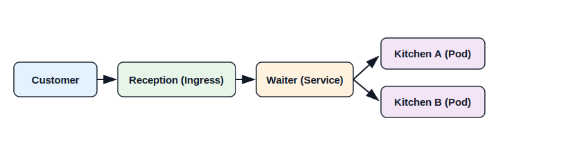

# 🍽️ Kubernetes Core Concepts (Restaurant Analogy)

This document explains the **6 most important Kubernetes concepts** using a restaurant system analogy.

---

## 🧠 Big Picture



---

# 🧱 1. Pod → Kitchen

### 🧠 Definition
A **Pod** is the smallest unit in Kubernetes that runs your application container.

### 🍳 Analogy
A **kitchen** where food is prepared.

- Each kitchen prepares dishes (runs containers)
- Can contain one or more containers
- Temporary in nature

### ⚠️ Important
```text
Pods are ephemeral → they can die and be recreated anytime
```

---

# 🧱 2. Deployment → Restaurant Manager

### 🧠 Definition

A **Deployment** ensures:

* Desired number of Pods
* Rolling updates
* Self-healing

### 👨‍💼 Analogy

A **restaurant manager** who ensures:

* Enough kitchens are running
* Broken kitchens are replaced
* New menu updates are applied smoothly

### Example

```yaml
replicas: 2
```

👉 Manager ensures 2 kitchens are always running

---

# 🧱 3. Service → Waiter

### 🧠 Definition

A **Service** provides a stable way to access Pods.

### 🧑‍🍽️ Analogy

A **waiter**:

* Takes orders from customers
* Sends them to available kitchens
* You don’t go directly to the kitchen

### Why Needed?

Pods:

```text
- Have dynamic IPs
- Can be recreated anytime
```

Service:

```text
Provides stable communication layer
```

---

# 🧱 4. Ingress → Reception

### 🧠 Definition

Ingress defines rules for external traffic routing.

### 🏢 Analogy

A **restaurant reception desk**:

* Entry point for customers
* Decides where to send them

### Example Routing

```text
/api → Backend kitchen
/ → Frontend kitchen
```

---

## ⚠️ Critical Detail

Ingress is ONLY rules.

You also need:
👉 Nginx Ingress Controller (actual receptionist)

Without it:

```text
Ingress exists ❌
But no one handles requests ❌
```

---

# 🧱 5. ConfigMap & Secret → Recipe Book

### 🧠 Definition

Used to store configuration data.

### 📖 Analogy

A **recipe book**:

| Type      | Meaning              |
| --------- | -------------------- |
| ConfigMap | Normal recipes       |
| Secret    | Confidential recipes |

---

### Example

```text
ConfigMap → API URL, ENV variables
Secret → Passwords, API keys
```

---

# 🧱 6. Node → Restaurant Building

### 🧠 Definition

A **Node** is a machine where Pods run.

### 🏢 Analogy

A **restaurant building**:

* Contains kitchens (pods)
* Can be physical or virtual

---

# 🧠 Complete Flow

```text
Customer → Reception → Waiter → Kitchen → Food
```

Equivalent Kubernetes flow:

```text
User → Ingress → Service → Pod → Response
```

---

# ⚠️ Key Insights (Very Important)

---

## 🔹 1. Kubernetes is NOT Docker

Docker:

```text
Run container → done
```

Kubernetes:

```text
Declare desired state → system maintains it
```

---

## 🔹 2. Pods Are Disposable

```text
If a pod dies → Kubernetes creates a new one automatically
```

---

## 🔹 3. Service is Mandatory

Without Service:

```text
No stable communication between components
```

---

## 🔹 4. Ingress Needs Controller

```text
Ingress YAML alone does nothing
```

Requires:

* Nginx
* or any ingress controller

---

## 🔹 5. Everything is Declarative

You don’t say:

```text
“run container”
```

You say:

```text
“I want 2 replicas”
```

Kubernetes ensures it.

---

## 🔹 6. System is Self-Healing

```text
Crash → Restart
Node failure → Reschedule
```

---

# 🎯 Summary Table

| Kubernetes Concept | Restaurant Analogy |
| ------------------ | ------------------ |
| Pod                | Kitchen            |
| Deployment         | Manager            |
| Service            | Waiter             |
| Ingress            | Reception          |
| Node               | Building           |
| ConfigMap / Secret | Recipe Book        |

---

# 🚀 Final Thought

Kubernetes is not about running containers.

It is about:

```text
Building systems that continue working even when things fail
```
